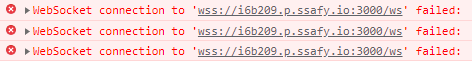

# Deployment

# Version

Backend : tomcat:9.0.50

Nginx : 1.21.6

Frontend : node:16.13.1

Signaling : node:16.13.1

FrontEnd in [socket.io](http://socket.io) : 4.4.1

Signaling in socket.io-client : 4.4.1

# SSL/TLS 인증서 발급

- 서버 내 certbot 다운로드

```bash
sudo apt-get install certbot
```

- 인증서 생성

```bash
certbot certonly --standalone [-d] 도메인
```

- standalone 모드로 해서 인증서에 대한 특별한 설정 없이 진행하도록 함
- domain name, email 등록
- /etc/letsencrypt/live/{도메인}[/](http://i6b209.p.ssafy.io/) 내에 파일 생성
    - cert.pem - 도메인 인증서(public key가 담겨있음)
    - chain.pem - 도메인 상위 기관 인증서
    - fullchain.pem - cert.pem + chain.pem
    - privkey.pem - private key
- 참고 사이트
    - [https://certbot.eff.org/instructions?ws=apache&os=ubuntufocal](https://certbot.eff.org/instructions?ws=apache&os=ubuntufocal)
    - [https://trend21c.tistory.com/2172](https://trend21c.tistory.com/2172)
    - [https://medium.com/@mashrur123/a-step-by-step-guide-to-securing-a-tomcat-server-with-letsencrypt-ssl-certificate-65cd26290b70](https://medium.com/@mashrur123/a-step-by-step-guide-to-securing-a-tomcat-server-with-letsencrypt-ssl-certificate-65cd26290b70)

# Backend

- war 파일 빌드
    - 따로 Tomcat을 사용할 것이기 때문에 스프링의 내장 Tomcat은 사용하지 않는다.
    
    ```jsx
    plugins {
    	id 'org.springframework.boot' version '2.6.3'
    	id 'io.spring.dependency-management' version '1.0.11.RELEASE'
    	id 'java'
    	id 'war'
    }
    
    group = 'com.ssafy'
    version = '0.0.1-SNAPSHOT'
    sourceCompatibility = '1.8'
    
    configurations {
    	compileOnly {
    		extendsFrom annotationProcessor
    	}
    }
    
    repositories {
    	mavenCentral()
    }
    
    bootWar.enabled = false
    war.enabled = true
    
    dependencies {
    	implementation 'org.springframework.boot:spring-boot-starter-data-jpa'
    	implementation 'org.springframework.boot:spring-boot-starter-security'
    	implementation 'org.springframework.boot:spring-boot-starter-web'
    	implementation 'org.springframework.boot:spring-boot-starter-websocket'
    
    	implementation 'com.auth0:java-jwt:3.10.3'
    
    	implementation 'com.github.gavlyukovskiy:p6spy-spring-boot-starter:1.5.6'
    
    	implementation 'org.springdoc:springdoc-openapi-ui:1.6.5'
    	implementation 'org.springdoc:springdoc-openapi-webmvc-core:1.6.5'
    
    	//	implementation 'io.springfox:springfox-swagger2:3.0.0'
    //	implementation 'io.springfox:springfox-swagger-ui:3.0.0'
    
    	implementation 'commons-io:commons-io:2.6'
    	implementation 'commons-fileupload:commons-fileupload:1.3.3'
    
    	implementation 'org.springframework.boot:spring-boot-starter-tomcat'
    
    	implementation'com.google.code.gson:gson:2.8.7'
    
    	compileOnly 'org.projectlombok:lombok'
    	developmentOnly 'org.springframework.boot:spring-boot-devtools'
    	runtimeOnly 'mysql:mysql-connector-java'
    	annotationProcessor 'org.projectlombok:lombok'
    	testImplementation 'org.springframework.boot:spring-boot-starter-test'
    	testImplementation 'org.springframework.security:spring-security-test'
    
    	implementation 'com.sun.mail:javax.mail:1.6.2'
    
    }
    
    tasks.named('test') {
    	useJUnitPlatform()
    }
    ```
    
- Dockerfile 작성
    
    ```docker
    FROM tomcat:9.0.50
    EXPOSE 8443
    CMD ["catalina.sh", "run"]
    ```
    
- docker-compose.yml 작성
    
    ```yaml
    version: '3.7'
    services:
        tomcat:
         container_name: tomcat_test
         restart: always
         environment:
          TZ: 'Asia/Seoul'
         build:
          context: .
          args:
           warpath: ./war/ROOT.war
           dockerfile: ./Dockerfile
         ports:
          - '8080:8443'
          - '8443:8443'
         volumes:           # 외부와 컨테이너 내부 파일 연동
          - ./tomcatVol/logs/:/usr/local/tomcat/logs/
          - ./imageVol/upload/:/usr/local/tomcat/webapps/upload/
          - ./imageVol/:/usr/local/tomcat/webapps/
          - ./tomcatVol/conf/server.xml:/usr/local/tomcat/conf/server.xml
          - ./tomcatVol/conf/keystore.p12:/usr/local/tomcat/conf/keystore.p12
          - ./tomcatVol/conf/cert.pem:/usr/local/tomcat/conf/cert.pem
          - ./tomcatVol/conf/fullchain.pem:/usr/local/tomcat/conf/fullchain.pem
          - ./tomcatVol/conf/privkey.pem:/usr/local/tomcat/conf/privkey.pem
          - ./tomcatVol/conf/chain.pem:/usr/local/tomcat/conf/chain.pem
          - ./profileImgVol/:/usr/local/tomcat/profileImgs/
    ```
    
- VM 내에 volume 적용할 폴더와 파일 생성
    - imageVol : war 파일 저장 경로 (ROOT 경로)
        - upload/
    - tomcatVol : tomcat 설정, 인증서 파일 저장 경로
        - conf
            - server.xml
            - keystore.p12, cert.pem, fullchain.pem, privkey.pem, chain.pem
                - server.xml 내부에 SSLHostConfig에 인증에 사용할 인증서 경로 입력
        - logs
    - profileImgVol : 프로필 이미지 저장 경로
    - war : docker-compse 실행 시 war 파일 읽는 경로
- docker-compose 실행

```bash
# docker-compose.yml이 있는 경로에서
docker-compose up
```

- tomcat 버전
    - tomcat10으로 했을 때 안됐는데
    - tomcat9로 하니까 됐다.
    - 서로 server.xml이 다르거나 어떤 설정 정보들이 다른 것 같다.
- 참고 사이트
    - [https://sang12.co.kr/193/Docker-Tomcat-Https-SSL-인증서-적용하기(LETSENCRYPT)](https://sang12.co.kr/193/Docker-Tomcat-Https-SSL-%EC%9D%B8%EC%A6%9D%EC%84%9C-%EC%A0%81%EC%9A%A9%ED%95%98%EA%B8%B0(LETSENCRYPT))
    - [https://tecadmin.net/how-to-install-lets-encrypt-ssl-with-tomcat/](https://tecadmin.net/how-to-install-lets-encrypt-ssl-with-tomcat/)

# Nginx

- nginx config 작성
    
    ```bash
    map $http_upgrade $connection_upgrade {
            default upgrade;
            ''      close;
    }
    
    # upstream은 서버 분산을 할 때 여러 서버들을 넣어놓는다
    upstream sig {
            server signaling:443;
    }
    
    upstream fe {
            server frontend:3000;
    }
    
    server {
        listen 4000 ssl;   # 3000으로 오는 ws를 받기 위해 적용
    
        server_name ${FQDN};
        ssl_certificate /etc/letsencrypt/live/${FQDN}/fullchain.pem;
        ssl_certificate_key /etc/letsencrypt/live/${FQDN}/privkey.pem;
    
    location ^~ /ws {
            rewrite ^/(api)/(socket)/(.*)$ /$2/$3 break;
            proxy_pass https://frontend:3000;
       
            proxy_http_version 1.1;
            proxy_read_timeout 1000;
            proxy_set_header Upgrade $http_upgrade;
            proxy_set_header Connection $connection_upgrade;
            proxy_set_header Host $host;
            proxy_set_header X-Real-IP $remote_addr;
            proxy_set_header X-Forwarded-For $remote_addr;
            proxy_redirect off;
            proxy_buffering off;
        }
    }
    
    server {
        listen 443 ssl;
        server_name ${FQDN};
        ssl_certificate /etc/letsencrypt/live/${FQDN}/fullchain.pem;
        ssl_certificate_key /etc/letsencrypt/live/${FQDN}/privkey.pem;
    
        client_max_body_size 10M;
    
        location / {
            #proxy_pass http://frontend:3000;
            proxy_pass https://fe;
            proxy_http_version 1.1;
    
    				proxy_set_header Host $host;
    
            proxy_set_header Upgrade $http_upgrade;
            proxy_set_header Connection $connection_upgrade;
            #proxy_set_header X-Real-IP $remote_addr;
            proxy_set_header X-Forwarded-For $remote_addr;
    
        }
    
        #socket.io.js파일 전용.
        location ^~ /socket.io/ {
            proxy_pass https://sig;
    
            proxy_http_version 1.1;
            proxy_set_header        X-Forwarded-For   $remote_addr; 
            proxy_set_header Upgrade $http_upgrade;
            proxy_set_header Connection $connection_upgrade;
            proxy_redirect off;
    
            proxy_buffering off;
    
    				proxy_set_header X-Real-IP $remote_addr;
            proxy_set_header Host $host;
            proxy_set_header X-NginX-Proxy true;
            proxy_set_header Access-Control-Allow-Origin *;
            proxy_read_timeout 2000;
    
        }
    
        location /signaling {
            proxy_pass https://sig;
    
            proxy_set_header        X-Forwarded-For   $remote_addr;
            proxy_http_version 1.1;
            proxy_set_header Upgrade $http_ugrade;
            proxy_set_header Connection $connection_upgrade;
            proxy_set_header Host $host;
            proxy_set_header X-Real-IP $remote_addr;
            proxy_set_header X-Forwarded-For $remote_addr;
            proxy_set_header Access-Control-Allow-Origin *;
            proxy_read_timeout 2000;
            proxy_redirect off;
            proxy_buffering off;
        }
    ```
    
- docker-compose.yml 작성
    
    ```yaml
    version: '3'
    services:
      proxy:
        restart: unless-stopped
        image: staticfloat/nginx-certbot
        ports:
          - 443:443/tcp
    			- 3000:4000/tcp  # 불필요, nginx conf에서 설정한 listen 4000을 받기 위해 사용
        environment:
          CERTBOT_EMAIL: doksakim77@naver.com
          ENVSUBST_VARS: FQDN
          FQDN: i6b209.p.ssafy.io
        volumes:
          - ./conf.d:/etc/nginx/user.conf.d
          - ./letsencrypt:/etc/letsencrypt/live/i6b209.p.ssafy.io
      frontend:
        build:
          context: .
          dockerfile: ./frontend/Dockerfile
        restart: unless-stopped
      signaling:
        build:
          context: .
          dockerfile: ./signaling/Dockerfile
        restart: unless-stopped
    ```
    

# Signaling

**Dockerfile** 

```docker
FROM node:16.13.1-alpine
# set working directory
WORKDIR /app

# add `/app/node_modules/.bin` to $PATH
ENV PATH /app/node_modules/.bin:$PATH

# install app dependencies
# COPY package.json ./
# COPY package-lock.json ./

COPY /signaling/package.json /app/package.json
RUN npm install 

# add app
COPY /signaling/. ./
WORKDIR /app/src
# start app
CMD ["npm", "run" ,"dev"]
```

- [socket.io](http://socket.io) 아래 설정은 공식 문서 Nginx에서 명시
    
    `proxy_set_header X-Forwarded-For $proxy_add_x_forwarded_for;`
    `proxy_set_header Host $host;`
    
    `proxy_http_version 1.1;`
    `proxy_set_header Upgrade $http_upgrade;`
    `proxy_set_header Connection "upgrade";`
    
- 웹소켓 연결 오류 해결
    
    
    
    - nginx.config 에 server 4000 포트 설정
    - docker-compose.yml nginx 3000:4000 포트 설정

- Signaling Settings
    - package.json
        - [socket.io](http://socket.io/) 버전 올리기
            
            
            
            [Socket.](http://Socket.io)IO 의 Nginx 호환 버전 표 ( [https://socket.io/docs/v4/client-installation/](https://socket.io/docs/v4/client-installation/) )
            
            - nginx에서 사용하기 위해선 서버 쪽 socket io 버전이 3이상이 돼야한다. (클라이언트는 2버전도 호환 가능)
            - 4.4.1 사용
    - server.js
        - io 생성 시 옵션 등록
            - cors 적용
                - origin 등록
                    - 접근 허용할 도메인 등록
                - transports 등록
                    - ws, wss, websocket, polling 등록
                - credentials 등록
                    - Access-Control-Allow-Credentials 에 필요하다
                    - 특정 origin만 신용하는 것이다.
            - allowEIO3 등록
                - 하위 버전의 client socket과의 통신을 허락한다.
        - namespace 적용
            - /signaling 를 경로로 proxy path를 하게 되면서 io.on으로 하던걸 NameSpace를 줘야하는 상황이 됨.
            - `io.on = io.of(’/’) → defalut , io.of(’/signaling’)`로 변경을 **꼭** 해야함
            - io.of('/signaling') 사용
            - to로 방을 지정해 이벤트를 보낼 수 있다.
            - io.of().sockets를 못쓴다.
                - io.sockets === io.of("/")
            - Main namespace
                - 기본으로 main namespace를 사용한다. (/)
                - io.on("connection") === io.of("/").on("connection")
    
- 참고 사이트
    - [https://blog.joon-lab.com/164](https://blog.joon-lab.com/164)
    - [https://socket.io/docs/v3/reverse-proxy/](https://socket.io/docs/v3/reverse-proxy/)

# Frontend

**Dockerfile**

- Frontend
    
    ```docker
    FROM node:16.13.1-alpine
    # set working directory
    WORKDIR /app
    
    # add `/app/node_modules/.bin` to $PATH
    ENV PATH /app/node_modules/.bin:$PATH
    
    # install app dependencies
    # COPY package.json ./
    # COPY package-lock.json ./
    
    COPY /frontend/package.json /app/package.json
    RUN npm install
    
    # add app
    COPY /frontend/. ./
    
    # start app
    CMD ["npm", "start"]
    ```
    
- Frontend Settings
    - package.json
        - 등록돼있던 proxy 제거
            - signaling server에서 FrontEnd에게 reponse를 보낼 때 등록돼있던 proxy에게 보내짐
        - dependency를 socker.io-client로 변경 (권장 사항)
        
    - UserConsulting.jsx
        - RTCPeerConnection의 config 설정 변경
            - pc_config 변수의 ice 서버를 여러개  등록하면 iceServer -> iceServers로 해야 변수가 인식된다.
                - 잘못써도 오류는 안나고 ice서버에 접근 못해도 ice candidate에 private ip만 담아서 클라이언트에게 보내서 네트워크 외부의 상대방과 연결할 수 없다.
                    - 네트워크 내부 연결은 가능하다.
            - 변수가 인식되지 않으면 ice서버에 접근하지 못해서 상대에게 로컬의 주소밖에 넘기지 못한다.
                - 내 public ip를 알 수 없고, 상대방도 내 public ip을 알 수 없다. 나도 상대방의 public ip를 받을 수 없다.
            - ice policy는 기본적으로 all로 private, public ip를 모두 가져온다.
        - SOCKET_SERVER_URL
            - 도메인/signaling으로 수정
                - ip주소/signaling으로 접근하면 ssl 오류가 발생한다.
            - 통신이 연결될 때, '/signaling'이 namespace(nsp)로 등록된다.
                - 추측
                    - signaling 서버는 '도메인' 이름으로 hositing 되지만 접근은 '도메인'/signaling으로 하고 있다.
                    - 이로 인해 '/signaling'이 nsp로 등록되는 듯 하다.
        - "disconnect" 이벤트 이름 변경
            - socket io 버전을4.4.1로 올렸을 때 기본 지정돼있던 이벤트 이름과 충돌이 발생했다.

# DB

```bash
docker pull mysql:원하는 버전 # mysql 이미지를 pull 받는다.
docker run --name 컨테이너명 -d -p 외부:내부 mysql
docker exec -it 컨테이너명 bash(안 되면 /bin/sh)
# 이후 내부에서 mysql 접속
```

- 참고 사이트
    - [https://poiemaweb.com/docker-mysql](https://poiemaweb.com/docker-mysql)